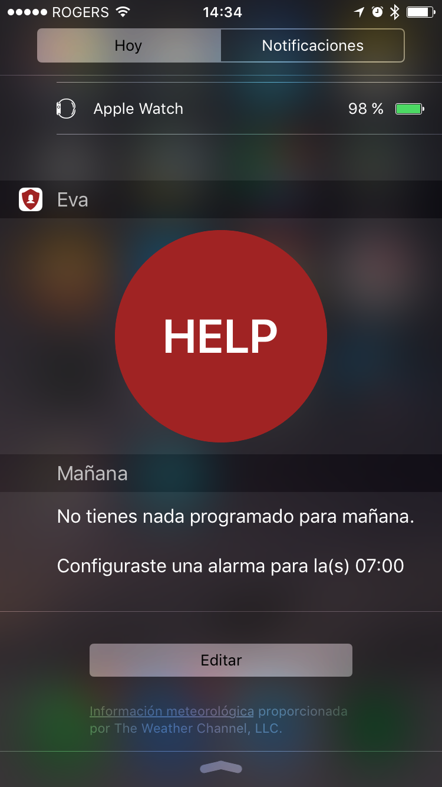
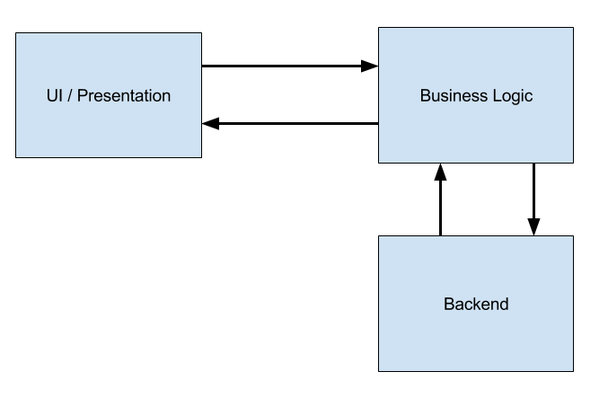
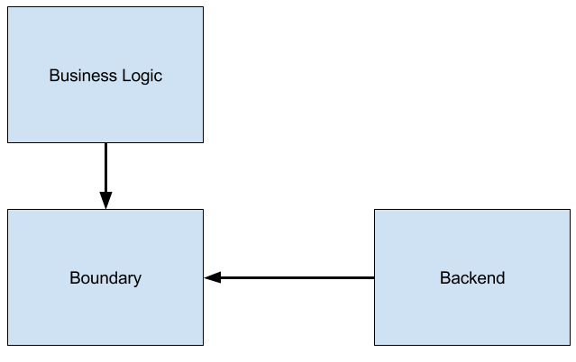
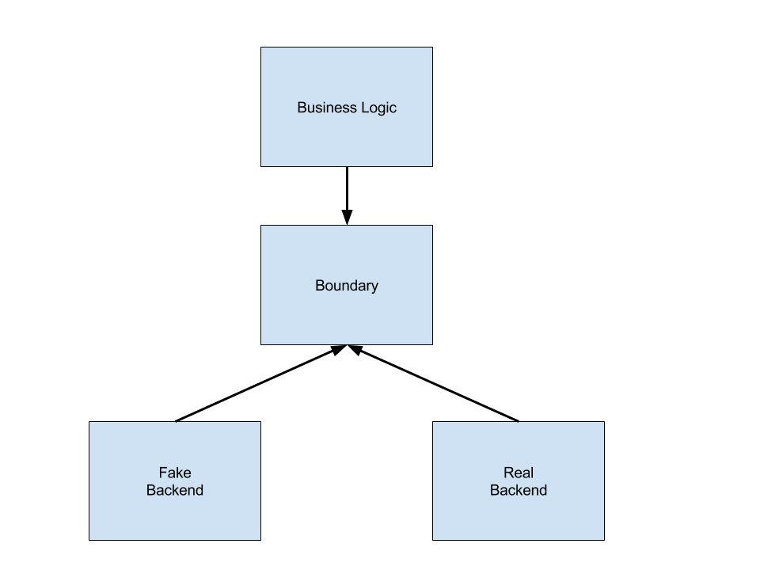

# Setting Boundaries

---


^ This weekend we participated in the VanHacks hackathon.
^ In this talk I will explain shortly how we handled the development process of the app we made.

---
# [fit] Francisco Díaz 
# @fco_diaz

  

^ I'm Francisco Díaz, I've been doing iOS development for 5 years.
^ I'm currently working at Axiom Zen Chile.
^ I'm also the co-organizer of a meetup like this one in Santiago, Chile called iOS Love.

^ You can contact me through twitter at @fco_diaz

---

#[fit] 3 
#### iOS Devs
#[fit] 28 
#### hours
#[fit] 1
#### project

### == Merge Conflicts

^ 3 iOS Developers, working 28 hours in the same project screams merge conflicts all over the place.
^ If we didn't plan, this could have been a merge conflict nightmare.

---

# What do we want?
- Minimize duplication of code.
- Develop independently without _stepping on each other's toes_.

^ If I start working on feature A I don't want somebody else to also do the same since it's a waste of time.

---

# Feature verticals:
- Big Panic button
- Today widget
- Knock

^ A first approach to the app would have been to divide each feature and assign it to one of us.

---

# Big Panic button:


^ So let's say I start working on the Big Panic button feature.

---

# What needs to be done?
- Create the button.
- We need a way to create reports.
- Make a backend call to save this information.

^ Two of the most obvious thing I'd need to do are these.
^ So when is pressed it needs to call the backend endpoint to start reporting an incident.
^ Also, it needs to change the status of the app to _reporting_. This way if we press again it will stop the report.
^ Let's say Camilo would start with the Today widget.

---

# Today widget:


---

# What needs to be done?
- Create the extension button.
- We need a way to create reports.
- Make a backend call to save this information.

---

# What was it that we wanted?
- ~~Minimize duplication of code.~~
- ~~Develop independently without _stepping on each other's toes_.~~

---


---

# Let's try again!

---

- Create the button.
- We need a way to create reports.
- Make a backend call to save this information.

---

# UI / Presentation
Create the button.

---

# Business logic
We need a way to create reports.

---

# Backend connection
Make a backend call to save this information.

---



^ So our new separation of concerns would look something like this.
^ We have a Presentation layer that will be in charge of managing the UI.
^ We also need a Business Logic layer, that handles how the app should behave. The logic of the app will be here.
^ We also have a layer to connect to the backend.

---

# To recap:
- Minimize duplication of code.
- ~~Develop independently without _stepping on each other's toes_.~~

^ So we managed to separate concerns. Now we're not duplicating code everywhere.
^ But it's very clear from the previous diagram that every aspect is tightly coupled to the other one. (Arrows goes both ways).

---

> We can solve any problem by introducing an extra level of indirection
-- David Wheeler

---

# Dependency inversion



^ We can fix this by using the dependency inversion principle.
^ We add a boundary in the middle.

---

```swift
struct ModelDataManager {
    let APIClient: APIType
    
    init(APIClient: APIType) {
        self.APIClient = APIClient
    }
}
```

^ So how does this look in code?
^ We'll have a ModelDataManager that will know when to make networking calls.
^ So it's initialized with an APIType.

---

```swift
protocol APIType {
    func createReport(completion: JSONDictionary? -> Void)
}

struct API {
    private let manager: Alamofire.Manager

    init() {
        manager = Alamofire.Manager()
    }
}

extension API: APIType {
    func createReport(completion: JSONDictionary? -> Void) {
        manager.request(.POST, "https://some.com/api/report")
            .responseJSON { response in
                completion(response)
        }
    }
}
```

^ But as we can see here, APIType is a protocol, not a struct or class.
^ Then API implements this protocol.

---

```swift
struct ModelDataManager {
    let APIClient: APIType
    
    init(API: APIType) {
        self.APIClient = API
    }
    
    static func defaultManager() -> ModelDataManager {
        let APIClient = API()
        return ModelDataManager(API: APIClient)
    }
    
    func createReport(completionHandler completion: Report? -> Void) {
        APIClient.createReport() { jsonDictionary in
            let report = ... // Parse jsonDictionary into Report
            completion(report)
        }
    }
}
```

^ So the ModelDataManager interacts with the APIType, not with API itself.

---

# Benefits
- Testable.
- Decoupled.
- Easy to fake our networking layer.

^ During the hackathon we were going very fast because we were 3 iOS devs.
^ After I finished implementing this layer, some endpoints in the backend were not ready yet, so we couldn't actually test the flow of the app because every call was failing.
^ But we didn't want to stop development just to put more pressure on poor Karim to finish the endpoints.

---



^ Since we have a protocol boundary, it's easy to fake my networking calls and to make them succeed all the time, so we can continue development.
^ Both Fake Backend and Real Backend conform to the same protocol. So how would that look like?

---

```swift
struct FakeAPI: APIType {
    func createReport(completion: JSONDictionary? -> Void) {
        let dictionary = ["id": 12345]
        completion(dictionary)
    }
}
```

^ We make FakeAPI conform to APIType as well and implement the method. 
^ We can return whatever the backend is supposed to return correctly.

---

```swift
struct ModelDataManager {
    let APIClient: APIType
    
    init(API: APIType) {
        self.APIClient = API
    }
    
    static func defaultManager() -> ModelDataManager {
        // let APIClient = API()
        let APIClient = FakeAPI() 
        return ModelDataManager(API: APIClient)
    }
}
```

^ And since ModelDataManager expects an APIType, and not an API, it's ok to just pass the FakeAPI and keep going with the app development.

---

# [fit] Questions?

Slides are available at: 
[https://github.com/fdiaz/settings-boundaries-talk](https://github.com/fdiaz/settings-boundaries-talk)

References:
[Architecture: The Lost Years](https://www.youtube.com/watch?v=WpkDN78P884)
[The Clean Architecture](https://blog.8thlight.com/uncle-bob/2012/08/13/the-clean-architecture.html)